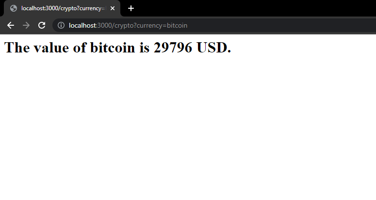

# CW Challenge

Resolution for the CW challenge technical assessment.

## Tasks 

- [x] Create new repository with vulnerable code.
- [x] Configure and enable Dependabot
- [x] Create script to get Dependabot alerts.
- [x] Display alerts on friendly way.
- [x] Integrate Dependabot with Discord.
- [x] Integrate Dependabot with Github Actions. 

---------------------------------------

## The application 

The application is a API to get prices of cryptocurrencys and renderize the prices with EJS.

### How to use

To use the API, send a GET request to ```/crypto/?currency=CURRENCY``` and get the price.



### The vulnerability 

The vulnerability of application is an **Server Side Template Injection** (based on **CVE-2022-29078**) that happens when the API can't find the currency.


---------------------------------------

## Resources

[CVE-2022-29078](https://eslam.io/posts/ejs-server-side-template-injection-rce/)
